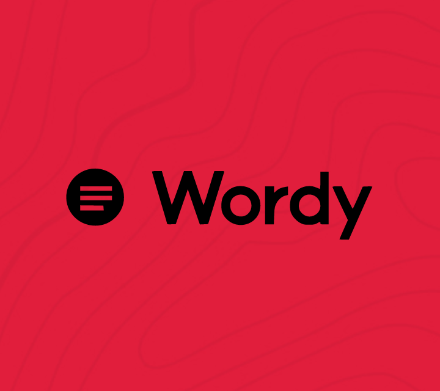

<!-- PROJECT LOGO -->
<br />
<p align="center">
  <a href="https://github.com/YunusEmreAlps/Flutter_Wordy_App/tree/master/wordy_app">
    
  </a>

  <h3 align="center">Wordy</h3>

  <p align="center">
    Dictionary
    <br />
    <a href="https://github.com/YunusEmreAlps/Flutter_Wordy_App">Download</a>
    ·
    <a href="https://github.com/YunusEmreAlps/Flutter_Wordy_App/issues">Report Bug</a>
    ·
    <a href="https://github.com/YunusEmreAlps/Flutter_Wordy_App/issues">Request Feature</a>
  </p>
</p>


<!-- TABLE OF CONTENTS -->
<details open="open">
  <summary>Table of Contents</summary>
  <ol>
    <li>
      <a href="#about-the-project">About The Project</a>
      <ul>
        <li><a href="#built-with">Built With</a></li>
      </ul>
    </li>
    <li>
      <a href="#getting-started">Getting Started</a>
      <ul>
        <li><a href="#prerequisites">Prerequisites</a></li>
        <li><a href="#clone">Clone</a></li>
      </ul>
    </li>
    <li><a href="#usage">Usage</a></li>
    <li><a href="#roadmap">Roadmap</a></li>
    <li><a href="#contributing">Contributing</a></li>
    <li><a href="#contact">Contact</a></li>
    <li><a href="#Screenshots">Screenshots</a></li>
  </ol>
</details>


<!-- ABOUT THE PROJECT -->
## About The Project
A simple dictionary app in flutter explaining the concept and usage of Streams and StreamBuilder. **SpeakWord is working**.

- Audio pronunciations – Never mispronounce another word
- Grammar help - Get grammar tips, word usage, and more
- Favorite words and search history - Customize your recently searched word list, and never forget the newest words you’ve learned
- English spelling help - Not sure how a word is spelled? This app will find it for you.


### Built With

* [Flutter](https://flutter.dev)
* [Firebase](https://firebase.google.com)
* [Google Maps](https://cloud.google.com/maps-platform)
* flutter_svg
* convex_bottom_bar
* simple_animations
* url_launcher
* http
* sqflite
* path_provider
* flutter_tts
* google_fonts
* regexed_validator
* share
* flutter_local_notifications
* animated_text_kit

<!-- GETTING STARTED -->
## 🚀 Getting Started

### Prerequisites

To run any Android application built with Flutter you need to configure the enviroments in your machine, you can do this following the the tutorial provided by Google in [Flutter website](https://flutter.dev/docs/get-started/install)

- Flutter SDK
- Android Studio (to download Android SDK)
- Xcode (for iOS develop only)
- Any IDE with Flutter SDK installed (ie. IntelliJ, Android Studio, VSCode etc)
- A little knowledge of Dart and Flutter

### Clone

- Clone this repo to your local machine using:

```
git clone https://github.com/YunusEmreAlps/Flutter_Wordy_App.git
```

### Setup

To run the app you need to have an online emulator or a plugged device and run the following command in the root of the application.

#### Android
```
flutter run
``` 
### iOS (_MAC Only_)

```
flutter run
``` 

<!-- ROADMAP -->
## Roadmap

See the [open issues](https://github.com/YunusEmreAlps/Flutter_Wordy_App) for a list of proposed features (and known issues).


<!-- CONTRIBUTING -->
## 🤔 Contributing

Contributions are what make the open source community such an amazing place to be learn, inspire, and create. Any contributions you make are **greatly appreciated**.

1. Fork the Project
2. Create your Feature Branch (`git checkout -b feature/AmazingFeature`)
3. Commit your Changes (`git commit -m 'Add some AmazingFeature'`)
4. Push to the Branch (`git push origin feature/AmazingFeature`)
5. Open a Pull Request


<!-- LICENSE -->
## 📝 License

Distributed under the MIT License. See `LICENSE` for more information.


<!-- CONTACT -->
## 📌 Contact

- Linkedin at [Yunus Emre Alpu](https://www.linkedin.com/in/yunus-emre-alpu-5b1496151/)

<!-- SCREENSHOTS -->
## Screenshots

Splash Screen               |  Home Page               | Search Page               |  Home Page
:-------------------------:|:-------------------------:|:-------------------------:|:-------------------------:
||||

Contact Part             |  Contact Part               | Contact Part               |  Saved Words Page
:-------------------------:|:-------------------------:|:-------------------------:|:-------------------------:
||||

Saved Words Page              |  Dictionary Page               | Dictionary Page               |  Dictionary Part
:-------------------------:|:-------------------------:|:-------------------------:|:-------------------------:
||||


## Video Preview of Final UI


